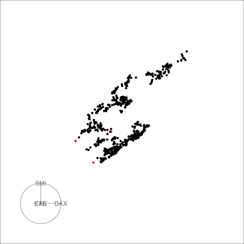
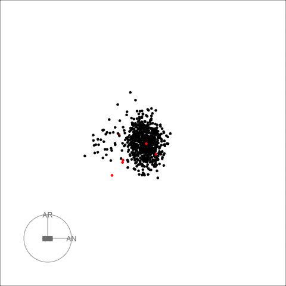

```{r setup0, include = FALSE}
knitr::opts_chunk$set(
  collapse = TRUE,
  comment = "#>",
  fig.width=8, fig.height=6
)
```

```{r load2, echo=FALSE, eval=TRUE, message=FALSE}
if (!requireNamespace("composits", quietly = TRUE)) {
    stop("Package composits is needed for the vignette. Please install it.",
      call. = FALSE)
}
if (!requireNamespace("forecast", quietly = TRUE)) {
    stop("Package forecast is needed for the vignette. Please install it.",
      call. = FALSE)
}
if (!requireNamespace("ggplot2", quietly = TRUE)) {
    stop("Package ggplot2 is needed for the vignette. Please install it.",
      call. = FALSE)
}
if (!requireNamespace("dplyr", quietly = TRUE)) {
    stop("Package dplyr is needed for the vignette. Please install it.",
      call. = FALSE)
}
if (!requireNamespace("tidyr", quietly = TRUE)) {
    stop("Package tidyr is needed for the vignette. Please install it.",
      call. = FALSE)
}
if (!requireNamespace("stringr", quietly = TRUE)) {
    stop("Package stringr is needed for the vignette. Please install it.",
      call. = FALSE)
}
if (!requireNamespace("rnaturalearthdata", quietly = TRUE)) {
    stop("Package rnaturalearthdata is needed for the vignette. Please install it.", call. = FALSE)
}
if (!requireNamespace("animation", quietly = TRUE)) {
    stop("Package animation is needed for the vignette. Please install it.", call. = FALSE)
}
```


```{r setup}
library(composits)
library(ggplot2)
library(forecast)
library(dplyr)
library(tidyr)
library(stringr)
library(rnaturalearthdata)
```

The goal of *composits* is to find outliers in compositional, multivariate and univariate time series. It is an outlier ensemble method that uses the outlier detection methods from R packages ``` forecast ```, ``` tsoutliers ```, ``` anomalize ``` and ```otsad ```. All the options provided in those packages can be included in the calls for each of the methods used in the ensemble function so that the user can create a more customize ensemble.

As describe in the paper four dimension reduction methods are used in the multivariate ensemble PCA, DOBIN, ICS and ICA. It is recomended that users
verified the scaling and centering options of these methods for each particular example.

## Univariate time series outliers
This example uses a univariate time series containing the daily gold prices from the R package ```forecast```.

```{r univaraite1}
gold2 <- forecast::na.interp(gold)
out <- uv_tsout_ens(gold2)
inds <- names(which(table(out$outliers) > 2))

ts_gold <- dplyr::as_tibble(gold2) %>% mutate(t = 1:length(gold2)) %>% rename(value = x)
ggplot(ts_gold, aes(x=t, y=value)) +
  geom_line() +
  geom_vline(xintercept =as.numeric(inds), color="red", alpha=0.8, size=0.5, linetype ='dashed') + ylab("Gold prices") + 
  theme_bw()
```

The red dashed vertical lines show the time points that have been picked by 3 or more outlier detection methods. 


Next we look at the quarterly production of woollen yarn in Australia. This time series is also taken from the R package ```forecast```. 

```{r univariate2}
out <- uv_tsout_ens(woolyrnq)
inds <- names(which(table(out$outliers) > 2))

ts_wool <- dplyr::as_tibble(woolyrnq) %>% mutate(t = 1:length(woolyrnq)) %>% rename(value = x)
ggplot(ts_wool, aes(x=t, y=value)) +
  geom_line() +
  geom_vline(xintercept =as.numeric(inds), color="red", alpha=0.8, size=0.5, linetype ='dashed') + ylab("Woollen Yarn Production") + 
  theme_bw()
```


## Multivariate time series outliers
This example includes EU stock market data from the package *datasets*. It contains the daily closing prices of 4 European stock indices: Germany DAX, Switzerland SMI, France CAC, and UK FTSE. First we plot the data. 

```{r multivariate1}
stpart <- EuStockMarkets[1:600, ]
stpart <- EuStockMarkets[1:600, ]
as_tibble(stpart) %>% mutate(t = 1:n())   %>%
  pivot_longer(cols=1:4)  %>%
  ggplot2::ggplot( ggplot2::aes(x = t, y = value, color = name)) +  ggplot2::geom_line() +  ggplot2::theme_bw() 
```

Then we find multivariate outliers. To find the multivariate outliers, first we decompose the time series to univariate outliers by using Principle Component Analysis (PCA), Independent Component Analysis (ICA), DOBIN (Distance based Outlier BasIs using Neighbours) and ICS (Invariant Coordinate Selection) decomposition methods. The ```fast=TRUE ``` option leaves out ICS decomposition. Then for a selected number of components (default being 2) we find outliers using the univariate time series ensemble.  The outliers are given in the table below. 


```{r mvout1}
out <- mv_tsout_ens(stpart, fast=TRUE)
out$outliers
draw_table_html(out)
```

The decomposed time series is shown in the figure below. 

```{r mvout2}
plot_decomposed_all(obj=out, X = stpart)
```

```{r mvani1, eval=F, echo=T}
animate_ts_ensemble(out, X= stpart,  max_frames = 100)
```

```{r mvani2, eval=F, echo=F}
library(animation)
saveGIF(
  animate_ts_ensemble(out, X= stpart,  max_frames = 100),
  movie.name = "mvani.gif", interval=0.2)
```




The decomposition above shows three decomposition methods. If you want to plot only one method, you can use the ```plot_decomposed``` function. The outlying time-points are shown in the figure above and below. 

```{r mvout3}
plot_decomposed(obj=out, X = stpart,  method = "pca")
```


## Composite time series outliers
For this example we use daily mortality counts in Spain organised by autonomous communities provided by the Spanish government. The dataset records mortality counts from the 18th of April 2018 until the 31th of July 2020. To make the data compositional we divide the autonomous communities counts by the total count for each day. 

Compositional data live on a simplex, because the sums add up to a constant. Before analysing such data, it is important to make the data unconstrained. We make the data unconstrained by using a coordinate transformation called the *null space coordinate transformation*. We use the multivariate outlier detection ensemble discussed above on these unconstrained data. More details are available in our paper. 

First let us load this data and plot it. 

```{r composite1}
data('spanish_morte')
df <- spanish_morte[[1]]
uniq_dates <- spanish_morte[[2]]
df2 <- cbind.data.frame(uniq_dates, df)
as_tibble(df2) %>%
  pivot_longer(cols=2:20)  %>%
  ggplot2::ggplot( ggplot2::aes(x = uniq_dates, y = value, color = name)) +  ggplot2::geom_line() +  ggplot2::theme_bw() 
```

Next we find the outliers using compositional time series outlier ensemble. 

```{r composite2}
out <- comp_tsout_ens(df, fast=FALSE)
out$outliers
draw_table_html(out, uniq_dates)
```

The table above shows the outlying dates and the associated scores. The outlying dates correspond to the COVID-19 outbreak. We can see the decomposed univariate time series in the following plot and the spike around mid March in 2020.  

```{r composite3}
plot_decomposed_all(obj=out, X = df)
# animate_ts_ensemble(out, X= df,  max_frames = 1)
```

```{r compani1, eval=F, echo=T}
animate_ts_ensemble(out, X= df,  max_frames = 100)
```

```{r compani2, eval=F, echo=F}
library(animation)
saveGIF(
  animate_ts_ensemble(out, X= df,  max_frames = 100),
  movie.name = "compani.gif", interval=0.2)
```



Next we apportion the outlying scores back to the autonomous communities. This is another coordinate transformation from the outlier score space to the original coordinate space. 

```{r composite4}
apportioned <- apportion_scores_comp(out)
apportioned1 <- cbind.data.frame(colnames(df), apportioned$scores_out)
colnames(apportioned1)[1] <- 'reg'
colnames(apportioned1)[2:dim(apportioned1)[2]] <-  paste(uniq_dates[out$outliers$Indices])
apportioned1
```

Next we plot this using the map of Spain.

```{r composite5}
df3 <- apportioned1 %>%
mutate(reg = str_replace(reg, "RI", "LO")) %>%
  mutate(reg = str_replace(reg, "NC", "NA")) %>%
  mutate(reg = str_replace(reg, "MC", "MU")) %>%
  pivot_longer(-reg, names_to = "date", values_to = "score")


spain <- rnaturalearth::ne_states(country = "spain", returnclass = "sf")
sp_regions <- spain %>%
  mutate(reg = str_sub(code_hasc, 4, 5)) %>%
  group_by(reg) %>%
  summarise()

# combine map info with data
# XXX dropping Canary islands for now
sp_data <- inner_join(sp_regions, df3, by="reg") %>%
  filter(reg != "CN")

#template for drawing map
sp_data %>%
  ggplot() +
  geom_sf(aes(fill=score)) +
  theme_bw() +
  scale_fill_distiller(palette = "YlOrBr", direction = 1) +
  facet_wrap(~date, ncol=6)

```

See our  [website](https://sevvandi.github.io/composits/index.html) or our paper [@composits] for more examples. 

# References
